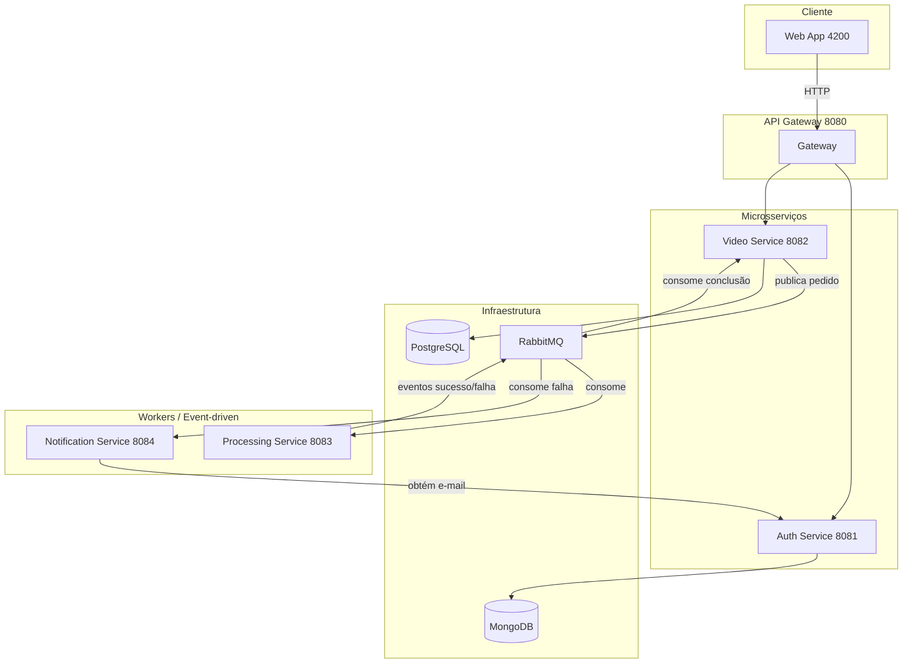

# Arquitetura do Projeto — Video Processor FIAP X

Documentação da **arquitetura proposta** para o sistema de processamento de vídeos. Descreve a visão do sistema, os componentes, as tecnologias e como a arquitetura atende aos requisitos essenciais.

---

## 1. Proposta de arquitetura

O sistema adota **arquitetura de microsserviços** com comunicação **assíncrona por mensageria** (RabbitMQ) para o fluxo de processamento de vídeos, e **API Gateway** como ponto único de entrada para as chamadas HTTP. As decisões principais:

- **Microsserviços:** cada responsabilidade (autenticação, vídeos, processamento, notificação) em um serviço independente, permitindo evolução e escalabilidade isoladas.
- **Event-driven:** o processamento de vídeo é disparado por mensagens na fila; em caso de pico, as requisições não se perdem (fila durável). Eventos de conclusão (sucesso ou falha) são publicados e consumidos pelo video-service e pelo notification-service.
- **API Gateway:** todas as requisições do cliente passam pelo gateway (porta 8080), que roteia para auth-service e video-service e valida JWT nas rotas protegidas.
- **Notificação em erro:** serviço dedicado (notification-service) consome eventos de falha, obtém o e-mail do usuário no auth-service e envia notificação por e-mail (os e-mails são enviados a um serviço de captura — Mailtrap — e chegam na caixa desse serviço).

### 1.1 Padrão interno: Arquitetura Hexagonal

Cada microsserviço foi desenvolvido seguindo **Arquitetura Hexagonal** (Ports and Adapters). O núcleo da aplicação (regras de negócio) fica na **porta** (domínio + casos de uso) e as integrações com o mundo externo (HTTP, filas, banco, SMTP) ficam em **adaptadores**.

**Por que escolhemos:** (1) **Testabilidade** — o domínio pode ser testado sem infraestrutura real, mockando os adaptadores. (2) **Troca de tecnologia** — trocar banco, fila ou provedor de e-mail não exige reescrever a lógica de negócio. (3) **Consistência** — todos os serviços seguem a mesma estrutura (pastas como `application`, `domain`, `infrastructure`), facilitando onboarding e manutenção. (4) **Foco no domínio** — a lógica de negócio não depende de detalhes de framework ou de protocolo.

**Vantagens na prática:** isolamento entre regras de negócio e infraestrutura; testes unitários e de integração mais simples; evolução de cada serviço sem acoplar ao restante do sistema.

---

## 2. Visão do sistema

### 2.1 Componentes de aplicação

| Componente | Porta | Função |
|------------|-------|--------|
| **Web App** | 4200 | Interface do usuário (Angular); login, upload, listagem de vídeos e status. |
| **API Gateway** | 8080 | Ponto de entrada único; roteia `/api/auth/**` e `/api/videos/**`; valida JWT. |
| **Auth Service** | 8081 | Registro, login (JWT), validação de token; consulta de usuário (ex.: e-mail para notificação). |
| **Video Service** | 8082 | Upload, metadados, listagem por usuário, status, download do ZIP; publica pedidos de processamento na fila; consome eventos de conclusão. |
| **Processing Service** | 8083 | Worker: consome fila de processamento, extrai frames (FFmpeg), gera ZIP; publica eventos de sucesso/falha. Sem API REST. |
| **Notification Service** | 8084 | Consome eventos de falha; obtém e-mail no auth-service; envia e-mail via SMTP (e-mails chegam no serviço de captura, Mailtrap). Sem API REST. |

### 2.2 Infraestrutura

| Componente | Uso |
|------------|-----|
| **RabbitMQ** | Filas para pedidos de processamento e para eventos de conclusão (sucesso/falha); garante não perda de requisições em pico. |
| **PostgreSQL** | Persistência de vídeos e metadados (video-service). |
| **MongoDB** | Persistência de usuários (auth-service). |
| **Storage (disco)** | Vídeos e ZIPs (volume compartilhado entre video-service e processing-service); S3 para ZIPs. |

### 2.3 Fluxo resumido

1. Usuário acessa a **Web App**, faz login (via gateway → auth-service) e envia vídeo (gateway → video-service).
2. **Video-service** grava o vídeo, persiste metadados e publica mensagem na fila de processamento.
3. **Processing-service** consome a fila, processa o vídeo (FFmpeg) e publica evento de sucesso ou falha na exchange de eventos.
4. **Video-service** consome eventos de conclusão e atualiza status do vídeo (e caminho do ZIP em sucesso).
5. **Notification-service** consome os mesmos eventos; em caso de falha, busca o e-mail do usuário no auth-service e envia notificação por e-mail (os e-mails são recebidos por um serviço - Mailtrap).

---

## 3. Stack tecnológica

| Camada | Tecnologia |
|--------|------------|
| Backend (microsserviços) | Java 21, Spring Boot, Spring AMQP, Spring Cloud Gateway |
| Autenticação | JWT (auth-service); validação no gateway |
| Persistência | MongoDB (auth), PostgreSQL (video), Flyway (migrations) |
| Mensageria | RabbitMQ (Spring AMQP) |
| Processamento de vídeo | FFmpeg (processing-service) |
| Frontend | Angular (web-app) |
| Orquestração | Docker Compose; imagens no GHCR |
| Testes / qualidade | JUnit, Mockito, Testcontainers, Cucumber (BDD), k6 (carga) |

---

## 4. Requisitos essenciais e como a arquitetura atende

| Requisito | Atendimento pela arquitetura |
|-----------|------------------------------|
| Processar mais de um vídeo ao mesmo tempo | **Processing-service** com múltiplos consumers RabbitMQ (paralelismo configurável); vários vídeos na fila são processados em paralelo. |
| Não perder requisição em picos | **RabbitMQ** com fila durável; o **video-service** enfileira o pedido e responde 202; em pico as mensagens permanecem na fila até serem processadas. DLQ para mensagens que falham após retentativas. |
| Sistema protegido por usuário e senha | **Auth-service** (registro, login, JWT); **API Gateway** valida o token em rotas protegidas e repassa as requisições aos backends. |
| Listagem de status dos vídeos por usuário | **Video-service** expõe listagem filtrada por usuário (metadados e status); **Web App** exibe para o usuário logado. |
| Notificação (e-mail) em caso de erro | **Notification-service** consome eventos de falha na fila, obtém o e-mail do usuário no **auth-service** e envia e-mail via SMTP. Notifica apenas em erro. Os envios são para um serviço de captura (Mailtrap): os e-mails chegam na caixa desse serviço. |

---

## 5. Diagrama de arquitetura

---

## 6. Documentos relacionados

- **README.md** — como rodar o projeto (Docker), tabela de requisitos essenciais, serviços e portas.
- **QUEUES.md** — detalhes das filas RabbitMQ, exchanges, bindings e diagrama de mensageria.
- **TESTES-FLUXO-COMPLETO.md** — guia de testes do fluxo completo, incluindo notificação em erro.
