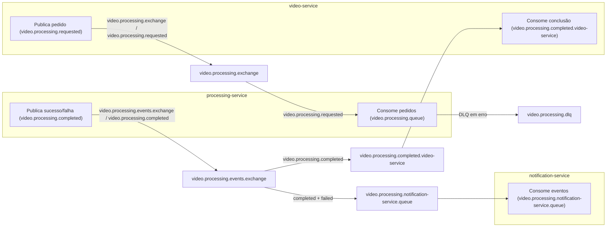

### Apanhado das filas

Documentação das filas RabbitMQ do Video Processor. Visão geral do sistema em [ARQUITETURA-DO-PROJETO.md](ARQUITETURA-DO-PROJETO.md).

#### Tecnologias

- **Mensageria**: RabbitMQ (Spring AMQP)

---

### Filas, serviços e parâmetros

#### 1. `video.processing.queue` (fila principal de processamento)

- **Tecnologia**: RabbitMQ  
- **Serviço(s)**:
  - **`processing-service`**: consumidor
- **Parâmetros**:
  - **Exchange**: `video.processing.exchange` (Topic)  
  - **Fila**: `video.processing.queue`  
  - **Routing key (binding)**: `video.processing.requested`  
  - **DLQ**:
    - `x-dead-letter-exchange = video.processing.dlq.exchange`
    - `x-dead-letter-routing-key = video.processing.dlq`
  - **Listener (container)**:
    - `minConcurrentConsumers = 5`, `maxConcurrentConsumers = 20`
    - `prefetchCount = 10`
    - `defaultRequeueRejected = false`

---

#### 2. Publicação de pedido de processamento (`video.processing.requested`)

- **Tecnologia**: RabbitMQ  
- **Serviço(s)**:
  - **`video-service`**: produtor
- **Parâmetros**:
  - **Exchange**: `video.processing.exchange`  
  - **Routing key (produtor)**: `video.processing.requested`  
- O binding da fila `video.processing.queue` usa a mesma routing key (`video.processing.requested`), alinhado ao produtor.

---

#### 3. `video.processing.completed.video-service` (conclusão para o `video-service`)

- **Tecnologia**: RabbitMQ  
- **Serviço(s)**:
  - **`video-service`**: consumidor
- **Parâmetros**:
  - **Exchange**: `video.processing.events.exchange` (Topic)  
  - **Fila**: `video.processing.completed.video-service`  
  - **Routing key**: `video.processing.completed`

---

#### 4. `video.processing.completed.processing-service` (eventos de sucesso – genérica)

- **Tecnologia**: RabbitMQ  
- **Serviço(s)**:
  - **`processing-service`**: produtor
- **Parâmetros**:
  - **Exchange**: `video.processing.events.exchange` (Topic)  
  - **Fila**: `video.processing.completed.processing-service`  
  - **Routing key**: `video.processing.completed`
- **Consumidores**:
  - Nenhum consumidor implementado no repositório.

---

#### 5. `video.processing.failed.processing-service` (eventos de falha)

- **Tecnologia**: RabbitMQ  
- **Serviço(s)**:
  - **`processing-service`**: produtor
- **Parâmetros**:
  - **Exchange**: `video.processing.events.exchange`  
  - **Fila**: `video.processing.failed.processing-service`  
  - **Routing key**: `video.processing.failed`
- **Consumidores**:
  - Nenhum consumidor implementado no repositório.

---

#### 6. `video.processing.dlq` (Dead Letter Queue)

- **Tecnologia**: RabbitMQ  
- **Serviço(s)**:
  - **`processing-service`**: define e usa como DLQ da fila principal
- **Parâmetros**:
  - **Exchange**: `video.processing.dlq.exchange` (Direct)  
  - **Fila**: `video.processing.dlq`  
  - **Routing key**: `video.processing.dlq`
- **Uso**:
  - Recebe mensagens redirecionadas da `video.processing.queue` via `x-dead-letter-*`.
  - Não há consumidores específicos implementados.

---

#### 7. `video.processing.notification-service.queue` (eventos para notificação)

- **Tecnologia**: RabbitMQ  
- **Serviço(s)**:
  - **`notification-service`**: consumidor
- **Parâmetros**:
  - **Exchange**: `video.processing.events.exchange` (Topic)  
  - **Fila**: `video.processing.notification-service.queue`  
  - **Routing keys (bindings)**: `video.processing.completed` e `video.processing.failed`
- **Uso**:
  - O **processing-service** publica tanto sucesso quanto falha na routing key `video.processing.completed` (exchange `video.processing.events.exchange`). O notification-service consome dessa fila e, para cada mensagem, verifica o campo `success`: em caso de **falha**, obtém o e-mail do usuário no auth-service e envia notificação por e-mail; em caso de sucesso, ignora (não notifica).
  - O envio é para um serviço de captura (**Mailtrap**): os e-mails chegam na caixa desse serviço. Requisito atendido: *notificação (e-mail) em caso de erro*.

---

### Gráfico Mermaid das ligações

