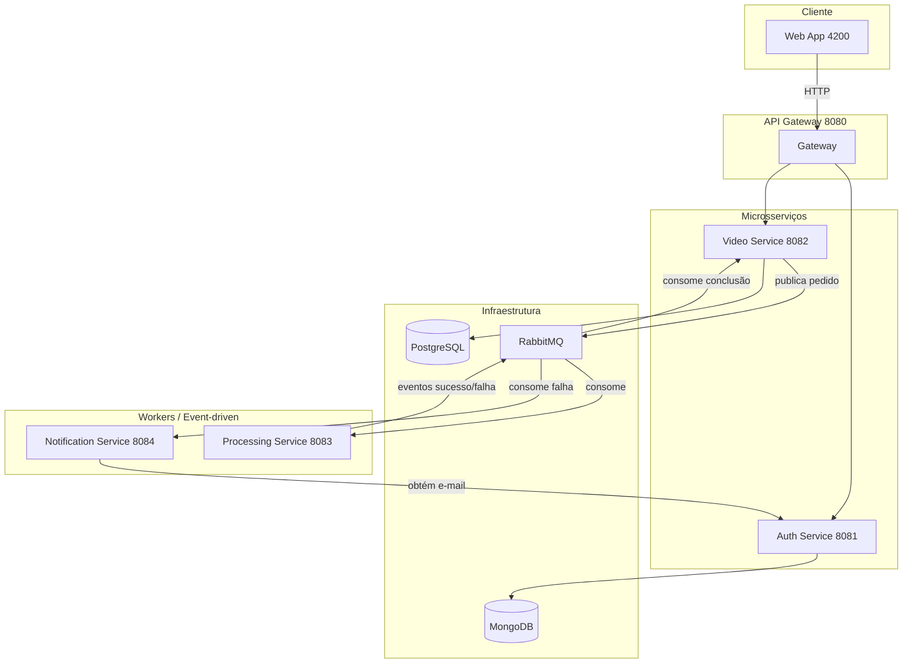

# 🎬 Video Processor - FIAP X

> Sistema de Processamento de Vídeos com Arquitetura de Microsserviços.

[](https://openjdk.org/)
[](https://spring.io/projects/spring-boot)
[](https://www.docker.com/)
[](https://www.rabbitmq.com/)
[](https://angular.io/)

---

## 👥 Desenvolvedores

| Nome | RM |
|------|-----|
| Hugo Braz de Seixas | 364849 |
| Igor de Sá Fernandes | 363052 |
| Marcus Fábio Liberato Salviano | 364454  |
| Vitor Braz Silva | 362120 |

## 🎥 Vídeo de Apresentação

[🔗 Link do vídeo de apresentação do projeto](URL_AQUI)

## 📐 Documentação da arquitetura

A arquitetura proposta do sistema (microsserviços, event-driven, API Gateway, requisitos essenciais e diagrama) está descrita em **[ARQUITETURA-DO-PROJETO.md](./ARQUITETURA-DO-PROJETO.md)**. Outros documentos na raiz: [QUEUES.md](./QUEUES.md) (filas RabbitMQ), [TESTES-FLUXO-COMPLETO.md](./TESTES-FLUXO-COMPLETO.md) (guia de testes do fluxo completo).

## 📋 Visão geral do projeto

### ✅ Requisitos essenciais (resumo)

| Requisito | Serviço(s) |
|-----------|------------|
| ⚡ Processar mais de um vídeo ao mesmo tempo | processing-service (múltiplos consumers RabbitMQ) |
| 📦 Não perder requisição em picos | video-service + RabbitMQ (fila durável) |
| 🔐 Sistema protegido por usuário e senha | api-gateway + auth-service |
| 📄 Listagem de status dos vídeos por usuário | video-service + web-app |
| 📧 Notificação (e-mail) em caso de erro | notification-service |

### 📊 Diagrama de arquitetura



### 🖥️ Serviços e portas

| Serviço              | Porta | URL base              |
|----------------------|-------|------------------------|
| 🌐 Web App (UI)      | 4200  | http://localhost:4200  |
| 🚪 API Gateway       | 8080  | http://localhost:8080  |
| 🔑 Auth Service      | 8081  | (via gateway)          |
| 🎞️ Video Service     | 8082  | (via gateway)          |
| ⚙️ Processing Service   | 8083  | (interno; sem API REST, só fila RabbitMQ) |
| 📬 Notification Service | 8084  | (interno; sem API REST, só consumer de eventos) |
| 🐰 RabbitMQ          | 5672 / 15672 | (interno / management) |
| 🍃 MongoDB           | 27017 | (interno ao auth)      |

> Todas as chamadas do cliente devem ir pelo **gateway** (8080). O gateway encaminha `/api/auth/**` para o auth-service e `/api/videos/**` para o video-service. Processing e notification são serviços internos — não possuem rota no gateway.

## 🐳 Como rodar (Docker)

Na raiz do projeto há dois arquivos Compose:

- **`compose.yml`** — define a stack completa: api-gateway, auth-service, video-service, processing-service e notification-service usam **imagens pré-construídas** no GitHub Container Registry (GHCR). O web-app é buildado localmente; RabbitMQ, MongoDB, Redis e Postgres usam imagens públicas.
- **`compose.dev.yml`** — arquivo de **override**: não substitui o `compose.yml`, e sim é carregado **em conjunto** com ele. Quando usado, adiciona `build` local aos cinco microsserviços e define `pull_policy: never`, dispensando o download de imagens do GHCR para desenvolvimento.

A ordem dos arquivos importa: o segundo sobrescreve/estende o primeiro.

### Dois modos de uso

**1️⃣ Rodar com imagens do GHCR** (recomendado para quem só vai subir a stack):

```bash
docker compose up -d
```

Exige estar logado no GHCR para o pull das imagens dos cinco serviços. Veja [Autenticação no GHCR](#autenticação-no-github-container-registry-ghcr) abaixo.

**2️⃣ Rodar em modo desenvolvimento** (build local dos microsserviços):

```bash
docker compose -f compose.yml -f compose.dev.yml up -d
```

Os cinco microsserviços são buildados a partir do código local; **não é necessário** pull do GHCR para eles. Útil para quem altera código e quer testar sem publicar imagem.

### 🔑 Autenticação no GitHub Container Registry (GHCR)

As imagens dos serviços estão em `ghcr.io/pos-tech-fiap-group/video-processor-*:latest`. Se o repositório de packages for privado, `docker compose up -d` (sem o override dev) falha no pull sem autenticação.

**Criar um Personal Access Token (PAT) no GitHub:**

- Acesse **Settings → Developer settings → Personal access tokens** (classic ou fine-grained).
- **Classic:** use o escopo `read:packages` (e `write:packages` se for fazer push de imagens).
- **Fine-grained:** conceda permissão de leitura nos packages da organização/repositório.

**Fazer login no GHCR:**

```bash
echo "<SEU_TOKEN>" | docker login ghcr.io -u <SEU_USUARIO_GITHUB> --password-stdin
```

Ou usando variável de ambiente (recomendado; **não coloque o token no README ou no repositório**):

```bash
echo "$GITHUB_TOKEN" | docker login ghcr.io -u <USUARIO> --password-stdin
```

Defina `GITHUB_TOKEN` no seu ambiente ou em um arquivo `.env` na raiz (e garanta que `.env` está no `.gitignore`).

**Resumo:** sem login no GHCR, use o modo desenvolvimento (`-f compose.yml -f compose.dev.yml`) para subir os cinco serviços via build local. Com login no GHCR, `docker compose up -d` consegue baixar as imagens do registry.

### 🔧 Variáveis de ambiente (Docker Compose)

O `compose.yml` lê variáveis do ambiente ou de um arquivo `.env` na raiz. Para autenticação no GHCR (modo 1), você pode usar `GITHUB_TOKEN` no `.env` apenas como referência para o comando `docker login` — não exponha o valor no repositório.

Para o **processing-service** enviar os zips de frames para o **S3** (em vez de só guardar em disco), defina:

| Variável | Descrição |
|----------|-----------|
| `AWS_ACCESS_KEY_ID` | Access key do usuário IAM com permissão de escrita no bucket |
| `AWS_SECRET_ACCESS_KEY` | Secret da access key |
| `AWS_REGION` | Região do bucket (ex.: `sa-east-1`) |
| `PROCESSING_STORAGE_S3_BUCKET` | Nome do bucket (ex.: `video-processor-zip-artifacts`) |

Se essas variáveis não forem definidas, o processing-service continua funcionando: o zip é gerado em disco e o caminho local é publicado na fila (o video-service e a UI podem usar o endpoint de download do backend). Com S3 configurado, o zip é enviado ao bucket (organizado por user UUID: `{userUuid}/{videoId}.zip`), a URL pública é publicada na fila e a UI pode baixar direto pelo link. Detalhes da configuração do bucket (leitura pública, escrita restrita) e do fluxo estão em [processing-service/README.md](processing-service/README.md#armazenamento-s3-opcional).

## 🔧 Microsserviços e frontend

| Serviço              | Pasta                    |
|----------------------|---------------------------|
| 🌐 Web App (UI)      | `web-app/`                |
| 🚪 API Gateway       | `api-gateway/`            |
| 🔑 Auth Service      | `auth-service/`           |
| 🎞️ Video Service     | `video-service/`          |
| ⚙️ Processing Service   | `processing-service/`    |
| 📬 Notification Service | `notification-service/`  |

---

Cada serviço e o frontend têm documentação própria na sua pasta. Resumo:

- **🌐 Web App** — Interface Angular: login, listagem de vídeos, upload e detalhe com status do processamento. Comunica com o API Gateway (8080). Detalhes: [web-app/README.md](web-app/README.md).
- **🚪 API Gateway** — Ponto de entrada único (porta 8080). Roteia `/api/auth/**` e `/api/videos/**` e valida JWT nas rotas protegidas. Detalhes, rotas e Postman: [api-gateway/README.md](api-gateway/README.md).
- **🔑 Auth Service** — Registro, login (JWT), validação de token e consulta de usuário (MongoDB). Rota interna `/internal/users/by-uuid/{uuid}` para o notification-service. Detalhes e Postman: [auth-service/README.md](auth-service/README.md).
- **🎞️ Video Service** — Upload (header `X-User-Id`), listagem por usuário, detalhes, `zipPath` para download do ZIP; consome eventos de conclusão na fila. Swagger em `http://localhost:8082/swagger-ui.html`. Detalhes: [video-service/README.md](video-service/README.md).
- **⚙️ Processing Service** — Worker: consome fila RabbitMQ, processa com FFmpeg, publica eventos; sem API REST. S3 opcional. Detalhes: [processing-service/README.md](processing-service/README.md).
- **📬 Notification Service** — Consome eventos de falha, obtém e-mail no auth-service e envia via SMTP (Mailtrap em dev). Sem API REST. Detalhes: [notification-service/README.md](notification-service/README.md).

> **Postman:** collections para API Gateway, Auth e Video Service; fluxo completo em [resources/Fluxo-Completo.postman_collection.json](resources/Fluxo-Completo.postman_collection.json).

## 📧 Notificação por e-mail (Mailtrap)

O **notification-service** envia os e-mails de falha de processamento para o **Mailtrap** (caixa do serviço). Os emails ficam disponíveis no painel do Mailtrap para inspeção. Abaixo, a caixa de entrada do Mailtrap com as notificações enviadas quando um vídeo falha no processamento.


## ⚡ Teste de carga com k6

Foi adicionada uma estrutura dedicada de carga em `load-tests/`.


### Windows (PowerShell)

Execucao basica com upload de video:

```powershell
./load-tests/k6/run-k6.ps1 `
  -VideoFile "C:\caminho\para\sample.mp4"
```

Exemplo com mais carga:

```powershell
./load-tests/k6/run-k6.ps1 `
  -VideoFile "C:\caminho\para\sample.mp4" `
  -UploadVus 5 `
  -UploadDuration "1m"
```

### Linux / Ubuntu (bash)

Primeira vez, torne o script executavel:

```bash
chmod +x load-tests/k6/run-k6.sh
```

Execucao basica com upload de video:

```bash
./load-tests/k6/run-k6.sh \
  -VideoFile "/caminho/para/sample.mp4"
```

Exemplo com mais carga:

```bash
./load-tests/k6/run-k6.sh \
  -VideoFile "/caminho/para/sample.mp4" \
  -UploadVus 5 \
  -UploadDuration "1m"
```

Relatorios gerados por execucao (em ambos os scripts):

- `load-tests/reports/k6-<timestamp>-raw.json`
- `load-tests/reports/k6-<timestamp>-summary.json`
- `load-tests/reports/k6-<timestamp>.html`

Mais detalhes (parametros suportados, observacoes) estao em `load-tests/README.md`.

## 🔄 CI/CD

O projeto utiliza **GitHub Actions** para integração e entrega contínua de cada microsserviço.

- **📁 Workflows por serviço:** cada um dos cinco microsserviços (api-gateway, auth-service, video-service, processing-service, notification-service) possui um workflow em `.github/workflows/` (ex.: `ci-api-gateway.yml`), disparado em **push** e **pull request** na branch `main`, quando há alteração no código do respectivo serviço.
- **🔄 Etapas do pipeline:** (1) checkout; (2) configuração do JDK 21 e cache Maven; (3) **build e testes** (`mvn verify`) com meta de cobertura; (4) **análise estática no SonarCloud** (SonarCloud.io, organização `pos-tech-fiap-group`); (5) em push na `main`, **build da imagem Docker** e **push para o GitHub Container Registry (GHCR)** com tags `latest` e SHA do commit.
- **📦 Imagens:** as imagens são publicadas em `ghcr.io/<org>/video-processor-<serviço>:latest` e utilizadas pelo `compose.yml` na raiz do projeto.

## 📊 Análise Sonar (SonarCloud)

Abaixo estão as análises do SonarCloud para cada microsserviço. Os projetos estão em [SonarCloud](https://sonarcloud.io) (organização `pos-tech-fiap-group`).

### 🚪 API Gateway


### 🔑 Auth Service


### 🎞️ Video Service


### ⚙️ Processing Service


### 📬 Notification Service


